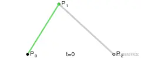
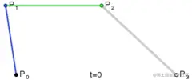
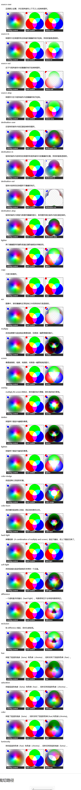

## 矩形知识点
beginPath()
新建一条路径，生成之后，图形绘制命令被指向到路径上生成路径。
closePath()
闭合路径之后图形绘制命令又重新指向到上下文中。
stroke()
通过线条来绘制图形轮廓。
fill()
通过填充路径的内容区域生成实心的图形。
lineTo(x, y)
绘制一条从当前位置到指定 x 以及 y 位置的直线。
clearRect(x, y, width, height)
清除指定矩形区域，让清除部分完全透明。

fill()会闭合区域，stroke()线段只会画出lineTo()所产生的线段

+ 获取上下文，拿到canvas对象
```js
   let cvs = document.getElementById("cvs");
    let ctx = cvs.getContext("2d");
```
 + 每次画笔开始结束代码块

```js
 ctx.beginPath();
 ctx.closePath();
 ```
 + 画笔开始时落点分别是（x,y）最标轴距离

```js
  ctx.moveTo(300, 400);
  ```

  + 实心矩形（x,y,矩形宽度，矩形高度）可分开填写 ctx.rect(20,20,100,100); ctx.fill()

```js
 ctx.fillRect(20, 20, 100, 100);
 ```
 ## 圆形知识点
 + arc(x, y, radius, startAngle, endAngle, anticlockwise)

画一个以（x,y）为圆心的以 radius 为半径的圆弧（圆），从 startAngle 开始到 endAngle 结束，按照 anticlockwise 给定的方向（默认为顺时针）来生成
```
 ctx.arc(100, 100, 100, 0, Math.PI * 2,true);
 //x轴距离，y轴距离 ，半径，开始的角度，结束的角度，顺时针：false还是逆时针:true
 ```

 + arcTo(x1, y1, x2, y2, radius)

根据给定的控制点和半径画一段圆弧，再以直线连接两个控制点。
x1第一个控制点的 x 轴坐标。
y1第一个控制点的 y 轴坐标。
x2第二个控制点的 x 轴坐标。
y2第二个控制点的 y 轴坐标。
radius圆弧的半径。


## 贝塞尔曲线，用来画弧线

ctx.quadraticCurveTo( x1, x2, y1, y2 )
加上起始点共三个点，y1,y2为结束点，起始点和结束点一直做切线的点连起来就是弧线
p0起始点，p1贝塞尔曲线第一个点，p2贝塞尔曲线结束点



## 三次贝塞尔曲线
bezierCurveTo(cp1x, cp1y, cp2x, cp2y, x, y)
绘制三次贝塞尔曲线，cp1x,cp1y为控制点一，cp2x,cp2y为控制点二，x,y为结束点。
比二次贝塞尔曲线增加一个控制点


## Path2D 对象
Path2D()
Path2D()会返回一个新初始化的 Path2D 对象（可能将某一个路径作为变量——创建一个它的副本，或者将一个包含 SVG path 数据的字符串作为变量）。

```js

new Path2D();     // 空的 Path 对象
new Path2D(path); // 克隆 Path 对象
new Path2D(d);    // 从 SVG 建立 Path 对象
```
所有的路径方法比如moveTo, rect, arc或quadraticCurveTo等，如我们前面见过的，都可以在 Path2D 中使用。
Path2D API 添加了 addPath作为将path结合起来的方法。当你想要从几个元素中来创建对象时，这将会很实用。比如：
Path2D.addPath(path [, transform])​
添加了一条路径到当前路径（可能添加了一个变换矩阵）。

## 样式颜色
fillStyle = color
设置图形的填充颜色。
strokeStyle = color
设置图形轮廓的颜色。

```js
 填充颜色
 ctx.fillStyle = "red";
 线段颜色
 ctx.strokeStyle = "green";
 ```
 颜色值 颜色字符串例red , rgb,  rgba, #000 ，都可以

 ```js
 ctx.fillStyle = "orange";
ctx.fillStyle = "#FFA500";
ctx.fillStyle = "rgb(255,165,0)";
ctx.fillStyle = "rgba(255,165,0,1)"
// 全局透明度 
ctx.globalAlpha=0.5
 ```

 ## 线性渐变,径向渐变
 渐变 Gradients
就好像一般的绘图软件一样，我们可以用线性或者径向的渐变来填充或描边。我们用下面的方法新建一个 canvasGradient 对象，并且赋给图形的 fillStyle 或 strokeStyle 属性。
 线性渐变 createLinearGradient
线段一边到另一边颜色从一种到另一种的改变
createLinearGradient(x1, y1, x2, y2)
createLinearGradient 方法接受 4 个参数，表示渐变的起点 (x1,y1) 与终点 (x2,y2)。
```js
let jianbian = ctx.createLinearGradient(300, 300, 400, 400);
    jianbian.addColorStop(0, "green");
    jianbian.addColorStop(1, "red");
    ctx.fillStyle = jianbian;
    ctx.fillRect(300, 300, 100, 100);
```
径向渐变createRadialGradient
圆形从圆心到另一个圆心发散产生的渐变
createRadialGradient(x1, y1, r1, x2, y2, r2)
createRadialGradient 方法接受 6 个参数，前三个定义一个以 (x1,y1) 为原点，半径为 r1 的圆，后三个参数则定义另一个以 (x2,y2) 为原点，半径为 r2 的圆。

```js
var lineargradient = ctx.createLinearGradient(0,0,150,150);
var radialgradient = ctx.createRadialGradient(75,75,0,75,75,100);
```

创建出 canvasGradient 对象后，我们就可以用 addColorStop 方法给它上色了。
gradient.addColorStop(position, color)
addColorStop 方法接受 2 个参数，position 参数必须是一个 0.0 与 1.0 之间的数值，表示渐变中颜色所在的相对位置。例如，0.5 表示颜色会出现在正中间。color 参数必须是一个有效的 CSS 颜色值（如 #FFF，rgba(0,0,0,1)，等等）。
你可以根据需要添加任意多个色标（color stops）。下面是最简单的线性黑白渐变的例子。

```js

var lineargradient = ctx.createLinearGradient(0,0,150,150);
lineargradient.addColorStop(0,'white');
lineargradient.addColorStop(1,'black');
```

圆锥渐变
按照转圈改变颜色渐变 addColorStop(position, color) 添加颜色
```js
createConicGradient(角度，位置x，位置y)
```

例子
```js
let conGradient = ctx.createConicGradient(Math.PI * 2 * 0, 300, 300);
    conGradient.addColorStop(0, "#000");
    conGradient.addColorStop(0.33, "green");
    conGradient.addColorStop(0.66, "red");
    conGradient.addColorStop(1, "white");
    ctx.fillStyle = conGradient;
    ctx.arc(300, 300, 200, 0, Math.PI * 2);
    ctx.fill();
```
## 图案样式 Patterns

createPattern(image, type)
该方法接受两个参数。Image 可以是一个 Image 对象的引用，或者另一个 canvas 对象。Type 必须是下面的字符串值之一：repeat，repeat-x，repeat-y 和 no-repeat。
图案的应用跟渐变很类似的，创建出一个 pattern 之后，赋给 fillStyle 或 strokeStyle 属性即可。

```js
var img = new Image();
img.src = 'someimage.png';
var ptrn = ctx.createPattern(img,'repeat');

```

例子
```js
  let img = new Image();
    img.src =
      "../src=http___img.duoziwang.com_2019_05_08211345616446.jpg&refer=http___img.duoziwang.webp"; //图片路径
    img.onload = () => {
      let ptrn = ctx.createPattern(img, "repeat-x");
      ctx.fillStyle = ptrn;
      ctx.fillRect(0, 0, 600, 600);
    };
```

 线型 Line styles
lineWidth = value
设置线条宽度。默认值为1
lineCap = type   
设置线条末端样式。可选值 utt 平齐，round 半圆 和 square 正方形。默认是 butt
lineJoin = type
设定线条与线条间接合处的样式。可选值 round 半圆, bevel  平和 miter 角。默认是 miter。
miterLimit = value
限制当两条线相交时交接处最大长度；所谓交接处长度（斜接长度）是指线条交接处内角顶点到外角顶点的长度。
getLineDash()
返回一个包含当前虚线样式，长度为非负偶数的数组。
setLineDash(segments)  segments为[a,b] a为线段长度，b为间距长度
设置当前虚线样式。
lineDashOffset = value
设置虚线样式的起始偏移量。

## 阴影 Shadows

shadowOffsetX = float 往x轴偏移
shadowOffsetX 和 shadowOffsetY 用来设定阴影在 X 和 Y 轴的延伸距离，它们是不受变换矩阵所影响的。负值表示阴影会往上或左延伸，正值则表示会往下或右延伸，它们默认都为 0。
shadowOffsetY = float 往y轴偏移
shadowOffsetX 和 shadowOffsetY 用来设定阴影在 X 和 Y 轴的延伸距离，它们是不受变换矩阵所影响的。负值表示阴影会往上或左延伸，正值则表示会往下或右延伸，它们默认都为 0。
shadowBlur = float  
shadowBlur 用于设定阴影的模糊程度，其数值并不跟像素数量挂钩，也不受变换矩阵的影响，默认为 0。
shadowColor = color
shadowColor 是标准的 CSS 颜色值，用于设定阴影颜色效果，默认是全透明的黑色。

## 使用图像 Using images
HTMLImageElement
这些图片是由 Image() 函数构造出来的，或者任何的 img 元素
HTMLVideoElement
用一个 HTML 的 video元素作为你的图片源，可以从视频中抓取当前帧作为一个图像
HTMLCanvasElement
可以使用另一个 canvas 元素作为你的图片源。
ImageBitmap
这是一个高性能的位图，可以低延迟地绘制，它可以从上述的所有源以及其它几种源中生成。
由零开始创建图像
或者我们可以用脚本创建一个新的 HTMLImageElement 对象。要实现这个方法，我们可以使用很方便的 Image() 构造函数。
这些源统一由 CanvasImageSource类型来引用。
```js
var img = new Image();   // 创建一个元素
img.src = 'myImage.png'; // 设置图片源地址
```
1.通过 data: url 方式嵌入图像
我们还可以通过 data:url 方式来引用图像。Data urls 允许用一串 Base64 编码的字符串的方式来定义一个图片。
```js
img.src = 'data:image/gif;base64,R0lGODlhCwALAIAAAAAA3pn/ZiH5BAEAAAEALAAAAAALAAsAAAIUhA+hkcuO4lmNVindo7qyrIXiGBYAOw==';
```

2.使用视频帧
你还可以使用video 中的视频帧（即便视频是不可见的）。例如，如果你有一个 ID 为“myvideo”的video 元素，你可以这样做：
```js
function getMyVideo() {
  var canvas = document.getElementById('canvas');
  if (canvas.getContext) {
    var ctx = canvas.getContext('2d');

    return document.getElementById('myvideo');
  }
}
```
3.drawImage(image, x, y)  图片，图片x坐标，y坐标
其中 image 是 image 或者 canvas 对象，x 和 y 是其在目标 canvas 里的起始坐标。

 drawImage 方法的又一变种是增加了两个用于控制图像在 canvas 中缩放的参数。
drawImage(image, x, y, width, height)  图片，图片x坐标，y坐标 ,图片宽度，图片高度
这个方法多了 2 个参数：width 和 height，这两个参数用来控制 当向 canvas 画入时应该缩放的大小
切片 Slicing 

drawImage 方法的第三个也是最后一个变种有 8 个新参数，用于控制做切片显示的。
drawImage(image, sx, sy, sWidth, sHeight, dx, dy, dWidth, dHeight)  图片  前四个参数裁剪坐标x,y，裁剪宽度，高度 ，后四个参数 图片x,y轴距离 图片宽度高度
## 绘制视频
 通过drawImage  把视频标签同图片标签加在drawimg()
 ```js 
 let btn = document.getElementsByTagName("button")[0];
    btn.addEventListener("click", function () {
      video.play();
      render();
    });
    // 添加水印， 在视频上面增加一个图片
    let img = new Image();
    img.src =
      "../src=http___img.duoziwang.com_2019_05_08211345616446.jpg&refer=http___img.duoziwang.webp";
    console.log(video);
    // 渲染视频函数
    function render() {
      ctx.drawImage(video, 0, 0, 600, 600);
      ctx.drawImage(img, 0, 0, 100, 100);
      requestAnimationFrame(render);
  } 
``` 
控制图像的缩放行为 Controlling image scaling behavior
如同前文所述，过度缩放图像可能会导致图像模糊或像素化。您可以通过使用绘图环境的imageSmoothingEnabled属性来控制是否在缩放图像时使用平滑算法。默认值为true，即启用平滑缩放。您也可以像这样禁用此功能：

```js
ctx.mozImageSmoothingEnabled = false;
ctx.webkitImageSmoothingEnabled = false;
ctx.msImageSmoothingEnabled = false;
ctx.imageSmoothingEnabled = false;
```

## 绘制文本
+ canvas 提供了两种方法来渲染文本： 该方法必须在绘制文本之前使用不然没效果
fillText(text, x, y [, maxWidth])

+ 在指定的 (x,y) 位置填充指定的文本，绘制的最大宽度是可选的。
strokeText(text, x, y [, maxWidth])

+ 在指定的 (x,y) 位置绘制文本边框，绘制的最大宽度是可选的。
font = value

+ 当前我们用来绘制文本的样式。这个字符串使用和 CSS font 属性相同的语法。默认的字体是 10px sans-serif。
textAlign = value

+ 文本对齐选项。可选的值包括：start, end, left, right or center. 默认值是 start。
textBaseline = value

+ 基线对齐选项。可选的值包括：top, hanging, middle, alphabetic, ideographic, bottom。默认值是 alphabetic。
direction = value
+ 文本方向。可能的值包括：ltr, rtl, inherit。默认值是 inherit。
+ 预测量文本宽度
当你需要获得更多的文本细节时，下面的方法可以给你测量文本的方法。
measureText()   measureText(文本)  
将返回一个 TextMetrics对象的宽度、所在像素，这些体现文本特性的属性。

## 变形 Transformations
**重点  移动旋转缩放都是坐标系而不是图形**
save()
保存画布 (canvas) 的所有状态
restore()
save 和 restore 方法是用来保存和恢复 canvas 状态的，都没有参数。Canvas 的状态就是当前画面应用的所有样式和变形的一个快照。
Canvas 状态存储在栈中，每当save()方法被调用后，当前的状态就被推送到栈中保存。一个绘画状态包括：
- 当前应用的变形（即移动，旋转和缩放，见下）
- 以及下面这些属性：strokeStyle, fillStyle, globalAlpha, lineWidth, lineCap, lineJoin, miterLimit, lineDashOffset, shadowOffsetX, shadowOffsetY, shadowBlur, shadowColor, globalCompositeOperation, font, textAlign, textBaseline, direction, imageSmoothingEnabled
- 当前的裁切路径（clipping path），
你可以调用任意多次 
save方法。每一次调用 
restore 方法，上一个保存的状态就从栈中弹出，所有设定都恢复。

1.移动 Translating   
我们先介绍 translate方法，它用来移动 canvas 和它的原点到一个不同的位置。
translate(x, y)
translate方法接受两个参数。*x *是左右偏移量，y 是上下偏移量，

2.旋转 Rotating
第二个介绍 rotate方法，它用于以原点为中心旋转 canvas。
rotate(angle)
这个方法只接受一个参数：旋转的角度 (angle)，它是顺时针方向的，以弧度为单位的值。
旋转的中心点始终是 canvas 的原点，如果要改变它，我们需要用到 translate方法。

3.缩放 Scaling
接着是缩放。我们用它来增减图形在 canvas 中的像素数目，对形状，位图进行缩小或者放大。
scale(x, y)
scale方法可以缩放画布的水平和垂直的单位。两个参数都是实数，可以为负数，x 为水平缩放因子，y 为垂直缩放因子，如果比 1 小，会缩小图形，如果比 1 大会放大图形。默认值为 1，为实际大小。
画布初始情况下，是以左上角坐标为原点的第一象限。如果参数为负实数，相当于以 x 或 y 轴作为对称轴镜像反转（例如，使用translate(0,canvas.height); scale(1,-1); 以 y 轴作为对称轴镜像反转，就可得到著名的笛卡尔坐标系，左下角为原点）。
默认情况下，canvas 的 1 个单位为 1 个像素。举例说，如果我们设置缩放因子是 0.5，1 个单位就变成对应 0.5 个像素，这样绘制出来的形状就会是原先的一半。同理，设置为 2.0 时，1 个单位就对应变成了 2 像素，绘制的结果就是图形放大了 2 倍。

4.变形 Transforms
最后一个方法允许对变形矩阵直接修改。
transform(a, b, c, d, e, f)
这个方法是将当前的变形矩阵乘上一个基于自身参数的矩阵，如下面的矩阵所示：[ acebdf001 ]如果任意一个参数是Infinity，变形矩阵也必须被标记为无限大，否则会抛出异常。这个函数的参数各自代表如下：
a (m11)水平方向的缩放
b(m12)竖直方向的倾斜偏移
c(m21)水平方向的倾斜偏移
d(m22)竖直方向的缩放
e(dx)水平方向的移动
f(dy)竖直方向的移动
setTransform(a, b, c, d, e, f)
这个方法会将当前的变形矩阵重置为单位矩阵，然后用相同的参数调用 transform方法。如果任意一个参数是无限大，那么变形矩阵也必须被标记为无限大，否则会抛出异常。从根本上来说，该方法是取消了当前变形，然后设置为指定的变形，一步完成。
resetTransform()
重置当前变形为单位矩阵，它和调用以下语句是一样的：ctx.setTransform(1, 0, 0, 1, 0, 0);

## 组合 Compositing
globalCompositeOperation
我们不仅可以在已有图形后面再画新图形，还可以用来遮盖指定区域，清除画布中的某些部分（清除区域不仅限于矩形，像clearRect()方法做的那样）以及更多其他操作。

globalCompositeOperation = type
这个属性设定了在画新图形时采用的遮盖策略，其值是一个标识 12 种遮盖方式的字符串。



裁切路径

裁切路径和普通的 canvas 图形差不多，不同的是它的作用是遮罩，用来隐藏不需要的部分。如右图所示。红边五角星就是裁切路径，所有在路径以外的部分都不会在 canvas 上绘制出来。

如果和上面介绍的 globalCompositeOperation 属性作一比较，它可以实现与 source-in 和 source-atop差不多的效果。最重要的区别是裁切路径不会在 canvas 上绘制东西，而且它永远不受新图形的影响。这些特性使得它在特定区域里绘制图形时相当好用。
在 绘制图形 一章中，我只介绍了 stroke 和 fill 方法，这里介绍第三个方法clip。

clip()
将当前正在构建的路径转换为当前的裁剪路径。
我们使用 clip()方法来创建一个新的裁切路径。
默认情况下，canvas 有一个与它自身一样大的裁切路径（也就是没有裁切效果）。

## 像素操作
ImageData 对象
ImageData对象中存储着 canvas 对象真实的像素数据，它包含以下几个只读属性：
+ width
图片宽度，单位是像素
+ height
图片高度，单位是像素
+ data
Uint8ClampedArray 类型的一维数组，包含着 RGBA 格式的整型数据，范围在 0 至 255 之间（包括 255）。
data 属性返回一个 Uint8ClampedArray，它可以被使用作为查看初始像素数据。每个像素用 4 个 1bytes 值 (按照红，绿，蓝和透明值的顺序; 这就是"RGBA"格式) 来代表。每个颜色值部份用 0 至 255 来代表。每个部份被分配到一个在数组内连续的索引，左上角像素的红色部份在数组的索引 0 位置。像素从左到右被处理，然后往下，遍历整个数组。

Uint8ClampedArray 包含高度 × 宽度 × 4 bytes 数据，索引值从 0 到 (高度× 宽度 ×4)-1
例如，要读取图片中位于第 50 行，第 200 列的像素的蓝色部份，你会写以下代码：

```js
blueComponent = imageData.data[((50 * (imageData.width * 4)) + (200 * 4)) + 2];     

```
根据行、列读取某像素点的 R/G/B/A 值的公式：
```js
imageData.data[((50 * (imageData.width * 4)) + (200 * 4)) + 0/1/2/3];
```

你可能用会使用 Uint8ClampedArray.length 属性来读取像素数组的大小（以 bytes 为单位）：

```js
var numBytes = imageData.data.length;
```
创建一个 ImageData 对象
去创建一个新的，空白的 ImageData对象，你应该会使用createImageData() 方法。有 2 个版本的 createImageData() 方法。

```js
var myImageData = ctx.createImageData(width, height);
```

上面代码创建了一个新的具体特定尺寸的 ImageData对象。所有像素被预设为透明黑。
你也可以创建一个被 anotherImageData对象指定的相同像素的 ImageData对象。这个新的对象像素全部被预设为透明黑。这个并非复制了图片数据。
```js

var myImageData = ctx.getImageData(left, top, width, height); 
```

    这个方法会返回一个 ImageData对象，它代表了画布区域的对象数据，此画布的四个角落分别表示为 (left, top), (left + width, top), (left, top + height), 以及 (left + width, top + height) 四个点。这些坐标点被设定为画布坐标空间元素。
备注： 任何在画布以外的元素都会被返回成一个透明黑的 ImageData 对像。
这个方法也会在文章用画布操作视频中展示。

## 在场景中写入像素数据
你可以用 putImageData() 方法去对场景进行像素数据的写入。
```js
ctx.putImageData(myImageData, dx, dy);
```
dx 和 dy 参数表示你希望在场景内左上角绘制的像素数据所得到的设备坐标。
例如，为了在场景内左上角绘制 myImageData 代表的图片，你可以写如下的代码：

```js
ctx.putImageData(myImageData, 0, 0);
```

## 图片灰度和反相颜色
在这个例子里，我们遍历所有像素以改变他们的数值。然后我们将被修改的像素数组通过 putImageData() 放回到画布中去。invert 函数仅仅是去减掉颜色的最大色值 255.grayscale 函数仅仅是用红绿和蓝的平均值。你也可以用加权平均，例如 x = 0.299r + 0.587g + 0.114b 这个公式。更多资料请参考维基百科的Grayscale。
```js
 let img = new Image();
    img.src = "../图片/20190927090000198.jpeg";

    img.onload = function () {
      // 图片，图片x坐标，y坐标
      ctx.drawImage(img, 0, 0, 600, 600);
      let imgData = ctx.getImageData(0, 0, 600, 600);
      console.log(imgData);
      for (let i = 0; i <= imgData.data.length; i += 4) {
        var avg =
          (imgData.data[i] + imgData.data[i + 1] + imgData.data[i + 2]) / 3;
        imgData.data[i] = avg; //R
        imgData.data[i + 1] = avg;//G
        imgData.data[i + 2] = avg;//B
        imgData.data[i + 3] = 255;//A
      }
      ctx.putImageData(imgData, 0, 0);
```

canvas视频播放更改灰度
```js
 let img = new Image();
    img.src =
      "../图片/src=http___img.duoziwang.com_2019_05_08211345616446.jpg&refer=http___img.duoziwang.webp";
    // 渲染视频函数
    let context = document.getElementById("canvas").getContext("2d");

    function render() {
      ctx.drawImage(video, 0, 0, 600, 600);
      ctx.drawImage(img, 0, 0, 100, 100);

      let imgDate = ctx.getImageData(0, 0, 600, 600);
      for (let index = 0; index < imgDate.data.length; index += 4) {
        var avg =
          (imgDate.data[index] +
            imgDate.data[index + 1] +
            imgDate.data[index + 2]) /
          3;
        imgDate.data[index] = avg; //R
        imgDate.data[index + 1] = avg; //G
        imgDate.data[index + 2] = avg; //B
        imgDate.data[index + 3] = 255; //A
      }
      context.putImageData(imgDate, 0, 0);
      requestAnimationFrame(render);

```

缩放和反锯齿
在drawImage() 方法，第二个画布和imageSmoothingEnabled 属性的帮助下，我们可以放大显示我们的图片及看到详情内容。
我们得到鼠标的位置并裁剪出距左和上 5 像素，距右和下 5 像素的图片。然后我们将这幅图复制到另一个画布然后将图片调整到我们想要的大小。在缩放画布里，我们将 10×10 像素的对原画布的裁剪调整为 200×200。

```js
zoomctx.drawImage(canvas,
 Math.abs(x - 5), Math.abs(y - 5),
 10, 10, 0, 0, 200, 200);
 ```

 ## 保存图片
HTMLCanvasElement 提供一个 toDataURL() 方法，此方法在保存图片的时候非常有用。它返回一个包含被类型参数规定的图像表现格式的数据链接。返回的图片分辨率是 96dpi。

canvas.toDataURL('image/png')
默认设定。创建一个 PNG 图片。

canvas.toDataURL('image/jpeg', quality)
创建一个 JPG 图片。你可以有选择地提供从 0 到 1 的品质量，1 表示最好品质，0 基本不被辨析但有比较小的文件大小。
当你从画布中生成了一个数据链接，例如，你可以将它用于任何image元素，或者将它放在一个有 download 属性的超链接里用于保存到本地。
你也可以从画布中创建一个Blob对像。

canvas.toBlob(callback, type, encoderOptions)
这个创建了一个在画布中的代表图片的 Blob 对像。