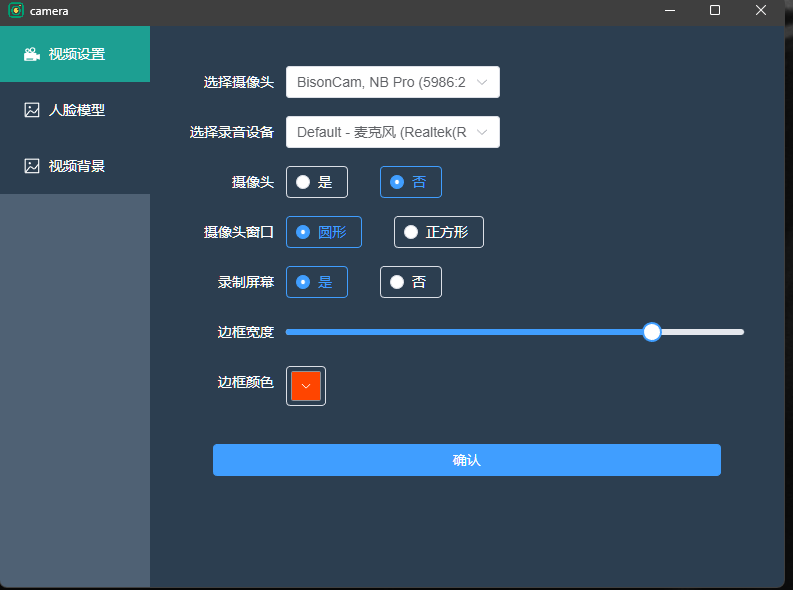
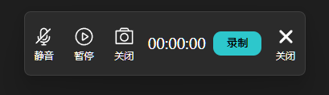
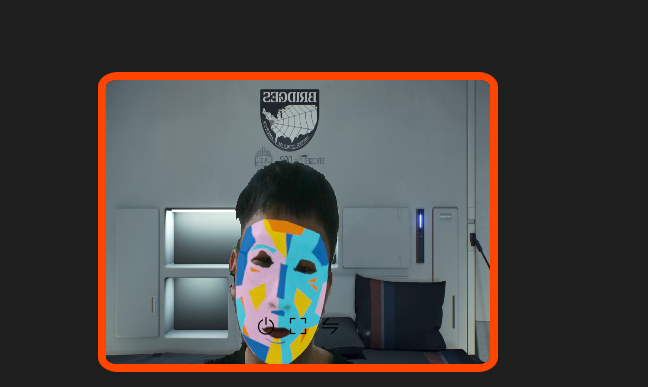
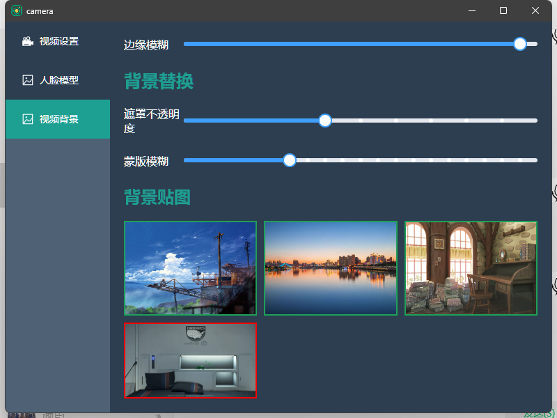
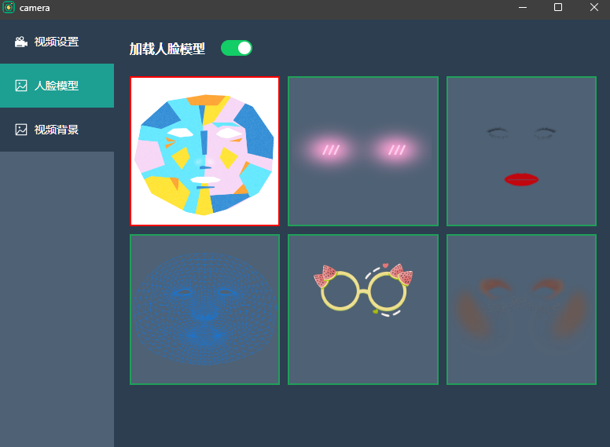

# electron-camera 案例 

 ## [electron](https://www.electronjs.org/zh/docs/latest/) 搭建
   
   使用[electron-vite](https://cn.electron-vite.org/guide/)搭建,自行查看文档

 ## 安装依赖
 Electron +Vue3+pinia +TypeScript+elementPlus

 该代码学习时所写，并不完善，如有误导，敬请谅解
## 创建窗口
  + 创建一个窗口类，分为主窗口，和其余窗口类
  + 默认窗口属性位窗口基础配置，可以根据自己项目自行更改
  + 加载html,加载vue单页面只能使用hash模式
  ```js
   if (windowConfig.path) {
        win.loadURL(process.env['ELECTRON_RENDERER_URL'] + `#${windowConfig.path}?id=${win.id}`)
      } else {
        win.loadURL(process.env['ELECTRON_RENDERER_URL'])
      }
```
根据窗口创建时唯一id确定窗口，进行窗口操作，主要进行窗口销毁聚焦，弹出等
  
下面是创建窗口代码不完善可以进行参考

```js
const { app, BrowserWindow } = require('electron')
//创建一个窗口宽高为800*600
const createWindow = () => {
  const win = new BrowserWindow({
    width: 800,
    height: 600
  })

  win.loadFile('index.html') //加载html
}

app.whenReady().then(() => {
  createWindow()
})
```
## 多窗口的创建及其封装


```js
import {
  BrowserWindow,
  BrowserWindowConstructorOptions,
  ipcMain,
  nativeImage,
  shell
} from 'electron'
import { join } from 'path'
// import url from 'url'
import { is } from '@electron-toolkit/utils'
// 录制屏幕
import screenCapturer from './desktopCapturer '
//暂未实现，有兴趣自己研究
interface Config {
  id?: string | number //唯一id
  path?: string // 页面路由URL '/manage?id=123'
  data?: null //数据
  isMultiWindow?: boolean //是否支持多开窗口 (如果为false，当窗体存在，再次创建不会新建一个窗体 只focus显示即可，，如果为true，即使窗体存在，也可以新建一个)
  isMainWin?: boolean //是否主窗口(当为true时会替代当前主窗口)
  parentId?: string //父窗口id  创建父子窗口 -- 子窗口永远显示在父窗口顶部 【父窗口可以操作】
  modal?: boolean //模态窗口 -- 模态窗口是禁用父窗口的子窗口，创建模态窗口必须设置 parent 和 modal 选项 【父窗口不能操作】
}
interface windowArr {
  id: string | number
  path?: string
}
class Window {
  main: null
  windowArr: windowArr[]
  constructor() {
    this.main = null //当前页
    this.windowArr = [] //窗口组
  }
  defaultConfig(): BrowserWindowConstructorOptions {
    return {
      width: 600,
      height: 600,
      show: false,
      autoHideMenuBar: true, //自动隐藏菜单栏
      alwaysOnTop: false, //是否保持在最上层
      skipTaskbar: true, //是否在任务栏中显示窗口
      resizable: true, //窗口是否可以改变尺寸
      titleBarStyle: 'default', //mac下隐藏导航栏
      maximizable: true,
      webPreferences: {
        preload: join(__dirname, '../preload/index.js'),
        sandbox: false,
        webSecurity: false //是否禁用同源策略
      }
    }
  }
  // 获取窗口
  getWindow(id) {
    return BrowserWindow.fromId(id)
  }
  // 获取全部窗口
  getAllWindows() {
    return BrowserWindow.getAllWindows()
  }

  // 创建窗口
  createWindows(options: BrowserWindowConstructorOptions & Config) {
  //默认配置与传进来配置合并
    const windowConfig = Object.assign({}, this.defaultConfig(), options)
    for (let i = 0; i < this.windowArr.length; i++) {
      const item = this.windowArr[i]
      if (this.getWindow(item.id) && item.path === options.path) {
        this.getWindow(Number(item.id))?.focus()
        return
      }
    }
    const win = new BrowserWindow(windowConfig)
    this.windowArr.push({
      path: windowConfig.path,
      id: win.id
    })

    // win.on('close', () => win.setOpacity(0))
    // 打开网址（加载页面）
    // HMR 用于基于electron cli 的渲染器。
    // 只能用hash模式
    if (is.dev && process.env['ELECTRON_RENDERER_URL']) {
      if (windowConfig.path) {
        win.loadURL(process.env['ELECTRON_RENDERER_URL'] + `#${windowConfig.path}?id=${win.id}`)
      } else {
        win.loadURL(process.env['ELECTRON_RENDERER_URL'])
      }
    } else {
      // 加载 index.html
      if (windowConfig.path) {
        win.loadFile(join(__dirname, '../renderer/index.html'), {
          hash: `${windowConfig.path}?id=${win.id}`
        })
      } else {
        win.loadFile(join(__dirname, '../renderer/index.html'))
      }
    }
    win.once('ready-to-show', () => {
      win.show()
    })

    // 当窗口被关闭时触发
    win.on('close', (event) => {
      if (windowConfig.isMainWin) {
        // 阻止默认行为
        event.preventDefault()
        // 隐藏窗口
        win.hide()
      }
    })
    win.webContents.setWindowOpenHandler((details) => {
      shell.openExternal(details.url)
      return { action: 'deny' }
    })
    const icon = nativeImage.createFromPath(join(__dirname, '../../resources/windowTray.png'))
    win.setIcon(icon)
    return win
  }
 
}

export default Window
```
## 多页面加载问题
win.loadFile(path.join(__dirname, '../renderer/index.html'), { hash: 'home' })

   Electron 不处理（浏览器）历史并使用同步 URL 加载页面。所以只有 hash 路由 可以工作。
对于 vue-router，你应该使用 createWebHashHistory 而不是 createWebHistory。
对于 react-router-dom，你应该使用 HashRouter 而不是 BrowserRouter。
当使用 hash 路由时，可以通过 BrowserWindow.loadFile 的第二个参数设置 hash 值来加载页面。

## 无边框窗口移动

1. 默认情况下, 无框窗口是 non-draggable 的。 应用程序需要指定 `-webkit-app-region: drag` 在 CSS 中告诉 Electron 哪个区域是可拖拽的 (像 OS 的标准标题栏), 并且应用程序也可以使用 `-webkit-app-region: no-drag` 来排除 draggable region 中的 non-draggable 区域。 请注意, 当前只支持矩形形状。

   要使整个窗口可拖拽, 您可以添加 `-webkit-app-region: drag` 作为 `body` 的样式:

    <body style="-webkit-app-region: drag"></body>

    请注意, 如果您已使整个窗口 draggable, 则必须将按钮标记为 non-draggable, 否则用户将无法单击它们:
   button { -webkit-app-region: no-drag; }

 2.通过鼠标移动距离进行移动
 ```js
//  渲染进程代码
 function drag(winId: number) { //窗口id
  let dragging = false
  let startCoords = { x: 0, y: 0 }
  window.addEventListener('mousedown', (event) => {
    dragging = true
    startCoords = { x: event.screenX, y: event.screenY } //开始位置
  })

  window.addEventListener('mousemove', (event) => {
    if (dragging) {
    //计算移动距离
      const newCoords = { x: event.screenX, y: event.screenY }
      const move = {
        x: event.screenX - startCoords.x,
        y: event.screenY - startCoords.y
      }
   //ipc通信 进行位置移动
      window.api.drag(move, winId)
      startCoords = newCoords
    }
  })

  window.addEventListener('mouseup', () => {
    dragging = false
  })
}
export default drag

  // 拖动  通信进程
  drag: async (opt: { x: number; y: number }, winId) => {
    await ipcRenderer.invoke('drag', opt, winId)
  },

   //无边框 窗口移动 主进程代码
    ipcMain.handle('drag', (_, move, winId) => {
      if (winId) {
        const win = this.getWindow(Number(winId))
        const winBounds = win!.getBounds()
        //进行移动
        win?.setBounds({
          x: winBounds.x + move.x,
          y: winBounds.y + move.y,
          width: winBounds.width,
          height: winBounds.height
        })
      }
    })
    // 使用
    onMounted(() => {
  drag(Number(route.query.id))
})
```

## 屏幕录制
   

 1. 获取设备
  ```js
  
   async getUserMedia() {
      await navigator.mediaDevices
        .enumerateDevices()
        .then((devices) => {
          // 遍历设备列表
          devices.forEach((device) => {
            // 如果设备类型是视频输入设备，则输出设备信息
            if (device.kind === 'videoinput') {
              this.cameraArr.push({
                label: device.label,
                deviceId: device.deviceId
              })
            }
            if (device.kind === 'audioinput') {
              this.audioArr.push({ label: device.label, deviceId: device.deviceId })
            }
          })
        })
        .catch(function (err) {
          console.error('获取设备列表失败:', err)
          ElNotification({
            title: '获取设备列表失败',
            message: err,
            type: 'error'
          })
        })
    }
  ```
  2.录制屏幕
   
   屏幕录制和浏览器略微不一样,首先在主进程获取窗口列表进行录制窗口选择
```js
desktopCapturer
      .getSources({
        types: ['screen'],
        // thumbnailSize: {
        //   height: 300, // 窗口或屏幕的截图快照高度
        //   width: 300 // 窗口或屏幕的截图快照宽度
        // },
        fetchWindowIcons: true // 如果视频源是窗口且有图标，则设置该值可以捕获到的窗口图标
      })
      .then(async (sources) => {
     // souces 为全部窗口列表，第一位为屏幕 当前录制为屏幕
        source = sources[0]
        // mainWindow.webContents.send('screenCapturer', source.id)
        return source.id
      })
   ```
  1. 之后在js通过`navigator.mediaDevices.getUserMedia`(constraints as any)获取屏幕流
```js
 const constraints = {
        audio: {
          mandatory: {
            // 无需指定mediaSourceId就可以录音了，录得是系统音频
            chromeMediaSource: 'desktop'
          }
        },
        video: {
          mandatory: {
            chromeMediaSource: 'desktop',
            chromeMediaSourceId: sourceId,
            width: { ideal: 1920 },
            height: { ideal: 1080 },
            codec: 'vp9',
            // 帧率
            maxFrameRate: 60
          }
        }
      }
       // 指定屏幕id只能使用getUserMedia
  vidioStream.value = await navigator.mediaDevices.getUserMedia(constraints as any)
//constraints中属性不能通过getdisplayMedia获取
``` 
4.音频轨道需要额外获取
```js
 audioStream = await navigator.mediaDevices.getUserMedia({
      audio: true
    })
```
5.合并视频轨道与音频轨道
```js
    // 同时通过MediaStream合并视频流与音频流
      const stream = new MediaStream([
        screenStream.getVideoTracks()[0],
        audioStream.getAudioTracks()[0]
      ])
    //   
```
6.
 + 通过[MediaRecorder](https://developer.mozilla.org/zh-CN/docs/Web/API/MediaRecorder)开始录制

  + 录制视频需要MediaRecorder(stream)
闲置中，录制中,暂停 inactive, recording, or paused
+ 录制中push进数组中通过blob下载
  recorder.addEventListener('dataavailable', (e) => {
    chunks.push(e.data)
  })
```js
recorder.value = new MediaRecorder(mediaStream, { mimeType: 'video/webm; codecs=vp9' })
```

7.结束录制并保存

```js
const endRecorder = (): void => {
  if ((recorder.value && recorder.value.state == 'recording') || recorder.value.state == 'paused') {
    recorder.value.stop()
    // 停止录制声音
    stopAudio()
    stopRecodTime()
    recorder.value.addEventListener('stop', () => {
      const blob = new Blob(chunks.value, { type: 'video/mp4' })
      const url = URL.createObjectURL(blob)
      const a = document.createElement('a')
      a.href = url
      const currentTime = new Date()
      a.download = `${currentTime.toLocaleString()}.mp4`
      a.click()
    })
    recorder.value = null
    chunks.value = []
  }
}

```


## electron摄像头调用
   
  

```js
<video ref="videoRef" autoplay muted="true" :class="{ reverse: config.reverse }"></video>
// 获取摄像头stream流
 navigator.mediaDevices.getUserMedia({ video: constraints.video }).then((stream) => {
    video.srcObject = stream  //把stream流赋值给video进行展示
    tracks.value = stream.getTracks()
  })

```

## 摄像头身体分割替换人体背景
   


  [tensorflow身体分割]（https://tensorflow.google.cn/js/models?hl=zh-cn）
 ```js 

 import * as bodySegmentation from '@tensorflow-models/body-segmentation'
import '@mediapipe/selfie_segmentation'
//  引入背景分割
    <canvas ref="canvasSegmentation" class="none" :class="{ reverse: config.reverse }"></canvas>
 // 获取身体位置
  const bodyModel = bodySegmentation.SupportedModels.MediaPipeSelfieSegmentation
  const segmenter = await bodySegmentation.createSegmenter(bodyModel, {
    runtime: 'mediapipe',
    modelType: 'landscape', // 'general', 'landscape
    solutionPath: '../../src/assets/model/@mediapipe/selfie_segmentation'
    // solutionPath: 'https://cdn.jsdelivr.net/npm/@mediapipe/selfie_segmentation'
  })
  // 替换背景
    const foregroundColor = { r: 0, g: 0, b: 0, a: 0 }
  const backgroundColor = { r: 0, g: 0, b: 0, a: 255 }

  let backdropImg = await loadImage(backgroundCutConfig.backdropImg)

  const backgroundReplace = async (): Promise<void> => {
    const people = await segmenter.segmentPeople(video, {
      flipHorizontal: false,
      multiSegmentation: false,
      segmentBodyParts: true
    })

    if (backgroundCutConfig.bokehOrSwitch) {
      await bodySegmentation.drawBokehEffect(
        canvas2D,
        video,
        people,
        backgroundCutConfig.foregroundThreshold,
        backgroundCutConfig.backgroundBlurAmount,
        backgroundCutConfig.edgeBlurAmount,
        false
      )
    } else {
      const backgroundDarkeningMask = await bodySegmentation.toBinaryMask(
        people,
        foregroundColor,
        backgroundColor
      )
      await bodySegmentation.drawMask(
        canvas2D,
        video,
        backgroundDarkeningMask,
        backgroundCutConfig.opacity,
        backgroundCutConfig.maskBlurAmount,
        false
      )
      // 合成
      ctx.putImageData(backgroundDarkeningMask, 0, 0)
      ctx.globalCompositeOperation = 'source-in'
      // // 背景图
      ctx.drawImage(backdropImg, 0, 0, video.videoWidth, video.videoHeight)
      ctx.globalCompositeOperation = 'destination-over'

      // // 视频
      ctx.drawImage(video, 0, 0, video.videoWidth, video.videoHeight)
      ctx.globalCompositeOperation = 'source-over'
    }
  }
 ```

 ## 人脸识别并添加贴图
   


   1.[tensrflow人脸识别](https://github.com/tensorflow/tfjs-models/tree/master/face-landmarks-detection)
 ```js
  <canvas ref="canvasRef" class="threeJs" :class="{ reverse: config.reverse }"></canvas>
// 引入three
import {
  AmbientLight,
  // Box3,
  BufferGeometry,
  DoubleSide,
  // Euler,
  Float32BufferAttribute,
  LinearFilter,
  Mesh,
  MeshBasicMaterial,
  // Object3D,
  OrthographicCamera,
  PlaneGeometry,
  PointLight,
  // Quaternion,
  SRGBColorSpace,
  Scene,
  Texture,
  TextureLoader,
  Uint16BufferAttribute,
  // Vector3,
  VideoTexture,
  WebGLRenderer
} from 'three'
// tensorflow 人脸识别
import '@mediapipe/face_mesh'

import * as tf from '@tensorflow/tfjs'
import * as faceLandmarksDetection from '@tensorflow-models/face-landmarks-detection'

// 加载模型
tf.setBackend('webgl')
  // 加载模型
  const faceMmodel = faceLandmarksDetection.SupportedModels.MediaPipeFaceMesh
  const detector = await faceLandmarksDetection.createDetector(faceMmodel, {
    //mediapipe参数 vite打包失败
    maxFaces: 1, //检测到的最大面部数量
    refineLandmarks: true, //可以完善眼睛和嘴唇周围的地标坐标，并在虹膜周围输出其他地标
    runtime: 'mediapipe', //tfjs，mediapipe
    solutionPath: 'https://cdn.jsdelivr.net/npm/@mediapipe/face_mesh'
    // solutionPath: new URL('../../public/face_mesh', import.meta.url).href
  })
    // 获取人脸位置信息
  const detectFaces = async (): Promise<void> => {
    faces = await detector.estimateFaces(video, { flipHorizontal: false })
    // 人脸加载完成进行贴图
    if (faces.length > 0) {
      const keypoints = faces[0]?.keypoints
      // 去除name属性，去除键名，返回人脸xyz数组
      const facePosition = keypoints
        .map((faces) => {
          const { name, ...rest } = faces
          return rest
        })
        .map((faces: { [s: string]: unknown } | ArrayLike<unknown>) => Object.values(faces))
      if (facePosition) {
        // 更新人脸位置
        updateGeometry(facePosition)
      }
    } else {
      // 未检测人脸贴图消失
      updateGeometry([])
    }
  }
  // 创建3d场景并初始化
    const scene = new Scene()
  //添加一些光照
  scene.add(new AmbientLight(0xcccccc, 0.4))
  const camera = new OrthographicCamera(
    windowWidth / -2,
    windowWidth / 2,
    windowHeight / 2,
    windowHeight / -2,
    100,
    1000
  )
  camera.position.set(0, 0, 1000)
  camera.add(new PointLight(0xffffff, 0.8))
  camera.position.set(0, 0, 0.15)
  scene.add(camera)
  const renderer = new WebGLRenderer({
    canvas: canvas,
    antialias: true,
    alpha: true
  })
  renderer.setPixelRatio(window.devicePixelRatio)
  renderer.setSize(window.innerWidth, window.innerHeight)
   //添加视频纹理，并将摄像头画面渲染
  let videoTexture
  if (backgroundCutConfig.isCut) {
    videoTexture = new Texture(canvas2D)
  } else {
    videoTexture = new VideoTexture(videoRef.value)
  }

  videoTexture.repeat.set(1, 1)
  videoTexture.minFilter = LinearFilter
  videoTexture.magFilter = LinearFilter
  // three.js  颜色值rgba,否则视频发白
  videoTexture.colorSpace = SRGBColorSpace
  //
  const canvasWidth = canvas.clientWidth
  const canvasHeight = canvas.clientHeight

  // 计算宽高比例
  const aspectRatio = canvasWidth / canvasHeight
  //
  // 创建材质大小和canvas大小一致
  let videoMaterial, videoCube
  video.addEventListener('loadeddata', async () => {
    // const videoWidth = video.videoWidth
    // const videoHeight = video.videoHeight
    // const videoAspectRatio = videoWidth / videoHeight
    const videoGeometry = new PlaneGeometry(canvasWidth, canvasWidth / aspectRatio)
    videoMaterial = new MeshBasicMaterial({
      map: videoTexture
    })
    videoCube = new Mesh(videoGeometry, videoMaterial)
    videoCube.position.set(0, 0, -800)
    scene.add(videoCube)
    camera.lookAt(videoCube.position)
  })
    //创建geometry，将468个人脸特征点按照一定的顺序(TRIANGULATION)组成三角网格，并加载UV_COORDS
  const geometry = new BufferGeometry()
  // 设置连接顺序
  geometry.setIndex(new Uint16BufferAttribute(TRIANGULATION, 1))
  //加载uv
  const uvAttribute = new Float32BufferAttribute(
    // uv中v是反的需要转换，如果不转换下巴在头上
    uvCoords.flat().map((item, index) => ((index + 1) % 2 ? item : 1 - item)),
    2
  )
   // 创建几何体对象并将顶点和 UV 属性设置给它
  geometry.setAttribute('uv', uvAttribute)
  // 创建material  加载贴图
  const textureLoader = new TextureLoader()
  let faceMaterial: MeshBasicMaterial
  textureLoader.load(faceModelConfig.modelUrl, (texture) => {
    texture.colorSpace = SRGBColorSpace
    texture.anisotropy = 16
    // 创建材质
    faceMaterial = new MeshBasicMaterial({
      map: texture,
      side: DoubleSide,
      transparent: true
    })
    faceMaterial.needsUpdate = true
    const mesh = new Mesh(geometry, faceMaterial)
    scene.add(mesh)
  })
    //从人脸检测模型获取的人脸网格坐标转换为模型位置
  const resolveMesh = (faceMesh, videoWidth, videoHeight): [] => {
    const canvasWidth = windowWidth
    const canvasHeight = windowHeight

    const scaleX = canvasWidth / video.videoWidth
    const scaleY = canvasHeight / video.videoHeight
    // 根据人脸位置计算视频中贴图位置
    return faceMesh
      .map((p: number[]) => [
        (p[0] - videoWidth / 2) * scaleX,
        (videoHeight / 2 - p[1]) * scaleY,
        -p[2] - 500
      ])
      .flat()
  }
   // updateGeometry方法用于更新Three.js场景中的几何体（geometry），以便根据检测到的人脸关键点的位置进行渲染。
  const updateGeometry = (prediction): void => {
    const positionBuffer = resolveMesh(prediction, video.videoWidth, video.videoHeight)
    videoTexture.needsUpdate = true
    geometry.setAttribute('position', new Float32BufferAttribute(positionBuffer, 3))
    geometry.computeVertexNormals()
    geometry.attributes.uv.needsUpdate = true
    geometry.attributes.position.needsUpdate = true
  }
   // 控制场景渲染
  const render = async (): Promise<void> => {
    // 背景替换
    if (backgroundCutConfig.isCut) {
      await backgroundReplace()
    }
    // 人脸贴图
    if (faceModelConfig.isFaceModel) {
      await detectFaces()
    } else {
      updateGeometry([])
      videoTexture.needsUpdate = true
    }
    // track(object3D, faces[0])
    renderer.render(scene, camera)
    loopRender.value = requestAnimationFrame(render)
  }
  video.addEventListener('loadeddata', async () => {
    video.style.display = 'none'
    render()
  })
 ```

 ## electron 窗口通信

  原理主要是浏览器跨窗口通信


+ StorageEvent
+ Broadcast Channel
+ SharedWorker
+ MessageChannel
  
  我用的vueuse封装的(Broadcast Channel)[Broadcast Channel]自行查看


## 打包配置

```json
"build": {
  "appId": "com.example.my-electron-app",
  "win": {
  <!-- 你需要添加一个 win 字段，这是用于配置 Windows 平台的打包选项。在 win 字段中，你需要指定 target 为 nsis，这是一个创建 Windows 安装程序的脚本工具 -->
    "target": "nsis"
  },
  <!-- directories 字段，这是用于配置构建资源的目录 -->
  "directories": {
    "buildResources": "build"
  },
  <!-- allowToChangeInstallationDirectory 字段启用了用户选择安装路径的功能 -->
  "nsis": {
       "oneClick": false,
    "allowToChangeInstallationDirectory": true
  }
}
<!-- electron打包上传git releases 自动更新 -->
 "publish": [
    {
      "provider": "github",
      "owner": "xxxxxxxxxx",
      "repo": "electron-camere",
      "releaseType": "release"
    }
  ]
   windows下添加环境变量GH_TOKEN
生成地址https://github.com/settings/tokens，之后添加环境变量

```